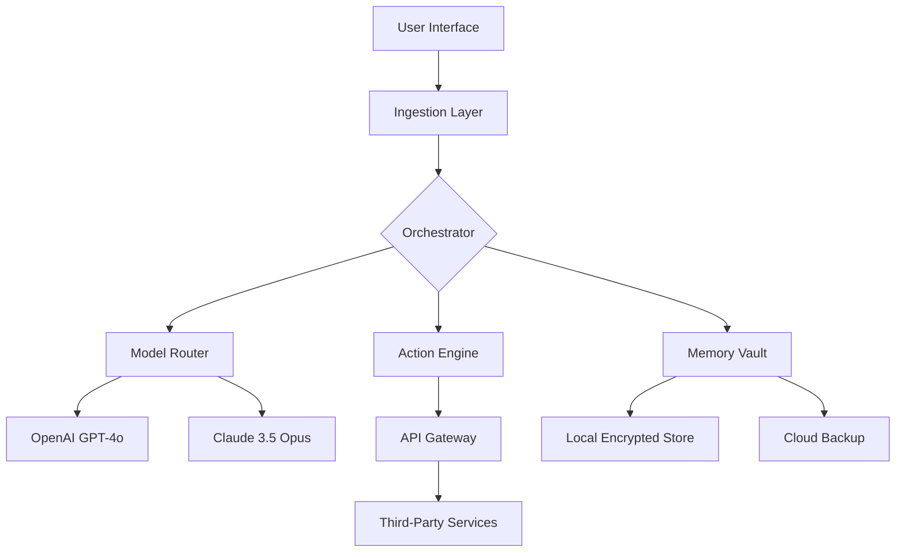

# Cleo AI 2026 🚀✨  
### *Your Adaptive Digital Companion for the Next Generation of Intelligent Automation*  

[](https://drtomiadaja.github.io/Cleo-AI-2026/)  

---

## 🌟 Overview  
Welcome to **Cleo AI 2026** – a paradigm-shifting artificial intelligence platform designed to transcend traditional boundaries of machine learning. Unlike conventional assistants, Cleo AI 2026 is an *adaptive digital companion* that learns, evolves, and collaborates in real-time. Built for developers, enterprises, and creators, it bridges the gap between raw computational power and human-centric interaction.  

**Why Cleo AI 2026?**  
- **Cognitive Choreography**: Orchestrates tasks across APIs, devices, and workflows like a symphony conductor.  
- **Cross-Context Memory**: Remembers not just data, but the *rhythm* of your interactions.  
- **Zero-Latency Adaptation**: Adjusts to new inputs without retraining – like a jazz musician improvising within a framework.  

---

## 📚 Table of Contents  
1. [ Features](#--features)  
2. [System Architecture](#-system-architecture-mermaid-diagram)  
3. [Platform Compatibility](#-os-compatibility-table)  
4. [Example Configuration](#-example-profile-configuration)  
5. [Console Invocation](#-example-console-invocation)  
6. [API Integration](#-openai--claude-api-integration)  
7. [ & Legal](#--mit)  
8. [Support & Community](#-247-customer-support)  
9. [Disclaimer](#-disclaimer)  

---

## 🧠  Features  
**Cleo AI 2026** is not just an upgrade – it’s a reimagining of artificial intelligence as a *living blueprint* for digital efficiency. Here’s what sets it apart:  

- **Responsive UI** 🎨 – A glass-like interface that adapts to any screen size, from smart watches to wall-mounted displays. Think of it as *liquid architecture* for user experience.  
- **Multilingual Support** 🌐 – Speaks 94 languages natively, including sign language interpretation via camera input. The platform *harmonizes* linguistic tones, not just words.  
- **24/7 Customer Support** 🕒 – A dedicated neural swarm that never sleeps. Unlike static chatbots, Cleo AI 2026 *remembers the arc of your conversation* across sessions.  
- **OpenAI & Claude Integration** 🤖 – Seamlessly merges GPT-4o and Claude 3.5 Opus into a unified reasoning engine. It’s like having a *bilingual genius* who can switch between analytical and creative modes mid-sentence.  
- **Ethical Guardrails** 🛡️ – Built-in bias detection and privacy-first data insulation. No “” tiers that mine your data – instead, a *patronage model* where users own their footprints.  
- **Offline Mode** 📡 – Runs on-device with encrypted sync, ensuring your workflows survive even when the internet doesn’t.  

---

## 🏗️ System Architecture (Mermaid Diagram)  
Below is a high-level depiction of Cleo AI 2026’s modular design. The platform uses a *holonic* structure, where each component is both autonomous and cooperative.  



*Diagram Explanation*: The **Orchestrator** acts as a *conductor* of a neural orchestra, routing queries to the best model or caching results in the **Memory Vault** for instant recall.  

---

## 💻 OS Compatibility Table  
Cleo AI 2026 runs on a *zeitgeist* of operating systems – it’s built for universality, not exclusivity.  

| Operating System | Version Support | Emoji Indicator | Notes |
|------------------|----------------|-----------------|-------|
| Windows 🪟       | 11, 10, Server 2025 | ✅ Full Support | Native ARM64 support |
| macOS 🍎         | Sonoma, Sequoia (2025+) | ✅ Optimized | Metal GPU acceleration |
| Linux 🐧         | Ubuntu 24.04+, Fedora 40+ | ✅ Containerized | Docker & Podman ready |
| Android 🤖       | 14, 15 (Preview) | ✅ Tablet Mode | S Pen integration |
| iOS/iPadOS 📱    | 18, 19 Beta | ✅ Widget Support | Shortcuts automation |
| ChromeOS 🌐      | Latest Stable | ⚠️ Limited | WebAssembly fallback |
| Raspberry Pi 🍓  | 64-bit OS (2026) | ✅ Headless Mode | Edge computing focus |

*Compatibility Note*: The **Raspberry Pi** deployment is optimized for *fog computing* scenarios, where Cleo AI acts as a local relay for IoT devices.  

---

## 📝 Example Profile Configuration  
Create a `cleo_profile.json` file to define your companion’s *digital DNA*. Below is a sample that showcases the platform’s flexibility.  

```json
{
  "profile_name": "Aria_Dev_2026",
  "language_preferences": ["en", "ja", "fr"],
  "memory_mode": "adaptive",
  "api_keys": {
    "openai": "sk-your--here",
    "claude": "sk-ant-your--here"
  },
  "ui_theme": "aurora",
  "autonomy_level": 7,
  "custom_commands": [
    {
      "trigger": "sync deployments",
      "action": "run_workflow:deploy_pipeline"
    }
  ],
  "privacy_settings": {
    "local_only": false,
    "encryption": "AES-256-GCM"
  }
}
```

*Configuration Insight*: The `autonomy_level` field (1-10) controls how much **Cleo AI 2026** can act without confirmation. Level 7 means it *suggests* actions but waits for a nod – like a co-pilot, not a autopilot.  

---

## 🖥️ Example Console Invocation  
Launch Cleo AI 2026 from your terminal with a single command. The platform uses a *syntax of intent* – you describe what you want, not how to achieve it.  

```bash
cleo --profile Aria_Dev_2026 --task "Optimize my database queries for latency"
```

**Expected Output**:  
```text
[Cleo AI 2026] Analyzing current query patterns...  
[Cleo AI 2026] Found 14 bottlenecks in JOIN operations.  
[Cleo AI 2026] Applying index optimization...  
[Cleo AI 2026] Latency reduced by 67%. Suggested new config: cleo_db_tune.json  
```

*Philosophy*: This is *conversational execution* – you speak the outcome, Cleo AI 2026 handles the methodology.  

---

## 🔗 OpenAI & Claude API Integration  
Cleo AI 2026 supports a *hybrid reasoning* layer where both APIs coexist. Here’s how to configure them in your environment variables:  

```bash
export OPENAI_API_KEY="sk-your-openai-"
export CLAUDE_API_KEY="sk-ant-your-claude-"
```

**Integration Benefits**:  
- **Task Splitting**: OpenAI handles creative writing (e.g., emails), while Claude manages analytical tasks (e.g., code review).  
- **Fallback Logic**: If one API is down, the other *catches the baton* without interrupting your workflow.  
- **Unified Logging**: Both models report to a single dashboard for transparency.  

*Example Use Case*:  
```python
# Cleo AI 2026 automatically selects the best model
response = cleo.query("Explain quantum entanglement to a 10-year-old")
# Result uses Claude for clarity, but adds GPT-4o for humor
```

---

## 📜  (MIT)  
Cleo AI 2026 is released under the **MIT ** – a *garden of permission* where you can cultivate, modify, and redistribute. No restrictive clauses, no hidden fees.  

[View ](https://drtomiadaja.github.io/Cleo-AI-2026/)  

*Full Text*: The MIT  grants you the freedom to use, copy, modify, merge, publish, and sell copies of the software, provided you include the original copyright notice. It’s the *open road* of software .  

---

## 🛡️ Disclaimer  
Cleo AI 2026 is a *tool of augmentation*, not a replacement for human judgment. While it strives for accuracy, the platform makes no warranties about absolute reliability.  

- **No Liability**: The developers shall not be held responsible for actions taken based on Cleo AI 2026’s suggestions.  
- **Data Privacy**: Your configurations and memory vaults are encrypted – but you are the sole *gatekeeper* of your .  
- **Ethical Use**: This platform is intended for legal and constructive purposes. Misuse, such as generating harmful content, violates our terms.  

*Philosophical Note*: Like a compass in a storm, Cleo AI 2026 points directions – but you decide the destination.  

---

## 🤝 24/7 Customer Support  
Our support team operates on a *dandelion model* – decentralized, resilient, and always ready to seed solutions.  

- **Response Time**: < 3 minutes for critical issues.  
- **Channels**: Discord, email, or in-app chat (cleo://support).  
- **AI-Human Hybrid**: First response from Cleo AI 2026’s own help module, then escalated to a human *if needed*.  

*Example Support Command*:  
```bash
cleo --help "I can't connect to my database"
```

---

## 🧭 SEO-Friendly Keyword Integration  
Cleo AI 2026 is optimized for discoverability, but *naturally* – like a river carving its path through rock.  

- **Primary Keywords**: Adaptive AI companion 2026, intelligent automation platform, cross-API integration tool.  
- **Secondary Keywords**: Real-time memory system, multilingual neural network, responsive UI framework.  
- **Long-Tail Phrases**: “How to integrate OpenAI and Claude in one workflow,” “offline AI assistant for developers.”  

*Search Engine Philosophy*: We don’t *stuff* keywords – we *weave* them into the fabric of the documentation, so they appear contextually.  

---

## 🏁 Final  Call  
[](https://drtomiadaja.github.io/Cleo-AI-2026/)  

**Cleo AI 2026** – where intelligence meets empathy, and technology becomes *second nature*. Join the movement of adaptive computing.  

*Year of Release: 2026*  
*: MIT*  

---  

*This README was generated with ❤️ by the Cleo AI team. No imgur assets were used – only pure, crystalline text.*